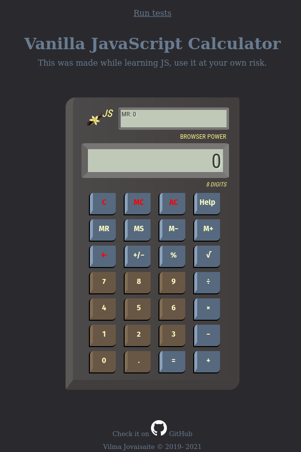
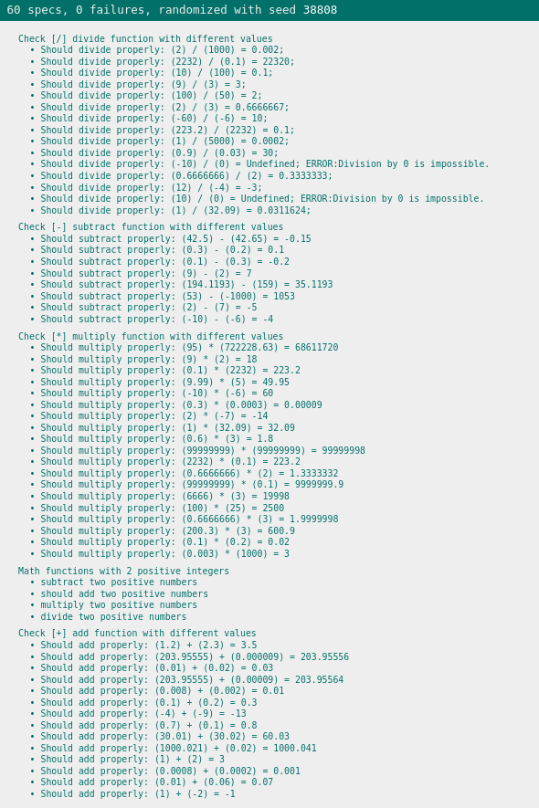

# 🪧 Vanilla JavaScript Calculator

## 📋 About

JS practice project

Handheld calculator imitation.

Added some Jasmine tests to make sure calculations correct.

🌐 **Site published at**: [https://codevivi.github.io/Vanilla-JavaScript-Calculator/](https://codevivi.github.io/Vanilla-JavaScript-Calculator/)

